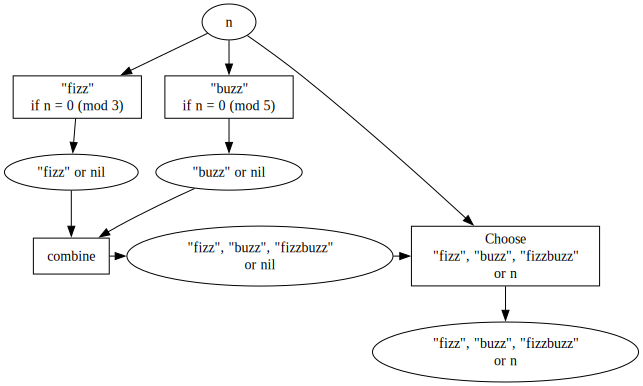
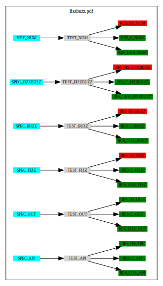

# Disclaimer

This document is not about
[Fizzbuzz](https://en.wikipedia.org/wiki/Fizz_buzz). This document is a
suggestion to simplify the build process of software projects, a demo of
an **homogeneous and consistent** development and documentation
environment. Fizzbuzz is just an application example.

# Links

- [fizzbuzz_slideshow.pdf](http://cdelord.fr/fizzbuzz/fizzbuzz_slideshow.pdf):
  PDF slideshow
- [fizzbuzz.pdf](http://cdelord.fr/fizzbuzz/fizzbuzz.pdf): PDF
  demonstration (specification, implementation, tests, test report,
  documentation generator, …)
- [github.com/CDSoft/fizzbuzz](https://github.com/CDSoft/fizzbuzz):
  Sources


# Introduction

Lots of software projects involve various tools, free as well as
commercial, to build the software, run the tests, produce the
documentation, … These tools use different data formats and scripting
languages, which makes the projects less scalable and harder to
maintain.

Sharing data between configuration files, documentations, tests results
can then be painful and counter productive (the necessary glue is often
more complex than the tools themselves).

Usually people script their build systems and processes with languages
like Bash, Python, Javascript and make them communicate with plain text,
YAML, JSON, XML, CSV, INI, TOML. Every script shall rely on specific
(existing or not) libraries to read and write these data formats.

This document presents a common and powerful data format and some tools
to script the build process of a project and generate documentation.

To sum up the suggested solution is:

- a **single data format**
- and a **reduced set of highly configurable tools**.

# Lua[^1]

[Lua](https://www.lua.org) is the perfect candidate for both a common
data format and a script language.

## What is Lua?

Lua is a powerful, efficient, lightweight, embeddable scripting
language. It supports procedural programming, object-oriented
programming, functional programming, data-driven programming, and data
description.

Lua combines simple procedural syntax with powerful data description
constructs based on associative arrays and extensible semantics. Lua is
dynamically typed, runs by interpreting bytecode with a register-based
virtual machine, and has automatic memory management with incremental
garbage collection, making it ideal for configuration, scripting, and
rapid prototyping.

## Why choose Lua?

**Lua is a proven, robust language**

Lua has been used in many industrial applications (e.g., Adobe’s
Photoshop Lightroom), with an emphasis on embedded systems (e.g., the
Ginga middleware for digital TV in Brazil) and games (e.g., World of
Warcraft and Angry Birds). Lua is currently the leading scripting
language in games. Lua has a solid reference manual and there are
several books about it. Several versions of Lua have been released and
used in real applications since its creation in 1993. Lua featured in
HOPL III, the Third ACM SIGPLAN History of Programming Languages
Conference, in 2007. Lua won the Front Line Award 2011 from the Game
Developers Magazine.

**Lua is fast**

Lua has a deserved reputation for performance. To claim to be “as fast
as Lua” is an aspiration of other scripting languages. Several
benchmarks show Lua as the fastest language in the realm of interpreted
scripting languages. Lua is fast not only in fine-tuned benchmark
programs, but in real life too. Substantial fractions of large
applications have been written in Lua.

**Lua is portable**

Lua is distributed in a small package and builds out-of-the-box in all
platforms that have a standard C compiler. Lua runs on all flavors of
Unix and Windows, on mobile devices (running Android, iOS, BREW,
Symbian, Windows Phone), on embedded microprocessors (such as ARM and
Rabbit, for applications like Lego MindStorms), on IBM mainframes, etc.

**Lua is powerful (but simple)**

A fundamental concept in the design of Lua is to provide meta-mechanisms
for implementing features, instead of providing a host of features
directly in the language. For example, although Lua is not a pure
object-oriented language, it does provide meta-mechanisms for
implementing classes and inheritance. Lua’s meta-mechanisms bring an
economy of concepts and keep the language small, while allowing the
semantics to be extended in unconventional ways.

**Lua is small**

Adding Lua to an application does not bloat it. The tarball for Lua 5.4,
which contains source code and documentation, takes 353K compressed and
1.3M uncompressed. The source contains around 30000 lines of C. Under
64-bit Linux, the Lua interpreter built with all standard Lua libraries
takes 281K and the Lua library takes 468K.

**Lua is free**

Lua is free open-source software, distributed under a very liberal
license (the well-known MIT license). It may be used for any purpose,
including commercial purposes, at absolutely no cost. Just download it
and use it.

# LuaX

[LuaX](https://github.com/CDSoft/luax) is a Lua interpreter and REPL
based on Lua 5.4, augmented with some useful packages. LuaX can also
produce standalone executables from Lua scripts.

LuaX runs on several platforms with no dependency:

- Linux (x86_64, aarch64)
- MacOS (x86_64, aarch64)
- Windows (x86_64)

LuaX can cross-compile scripts from and to any of these platforms.

LuaX comes with a standard Lua interpreter and provides some libraries
(embedded in a single executable, no external dependency required):

- [LuaX interactive
  usage](https://github.com/CDSoft/luax/blob/master/doc/repl.md):
  improved Lua REPL
- [F](https://github.com/CDSoft/luax/blob/master/doc/F.md): functional
  programming inspired functions
- [fs](https://github.com/CDSoft/luax/blob/master/doc/fs.md): file
  system management
- [sh](https://github.com/CDSoft/luax/blob/master/doc/sh.md): shell
  command execution
- [mathx](https://github.com/CDSoft/luax/blob/master/doc/mathx.md):
  complete math library for Lua
- [imath](https://github.com/CDSoft/luax/blob/master/doc/imath.md):
  arbitrary precision integer and rational arithmetic library
- [qmath](https://github.com/CDSoft/luax/blob/master/doc/qmath.md):
  rational number library
- [complex](https://github.com/CDSoft/luax/blob/master/doc/complex.md):
  math library for complex numbers based on C99
- [ps](https://github.com/CDSoft/luax/blob/master/doc/ps.md): Process
  management module
- [sys](https://github.com/CDSoft/luax/blob/master/doc/sys.md): System
  module
- [crypt](https://github.com/CDSoft/luax/blob/master/doc/crypt.md):
  cryptography module
- [lz4](https://github.com/CDSoft/luax/blob/master/doc/lz4.md):
  Extremely Fast Compression algorithm
- [lpeg](https://github.com/CDSoft/luax/blob/master/doc/lpeg.md):
  Parsing Expression Grammars For Lua
- [linenoise](https://github.com/CDSoft/luax/blob/master/doc/linenoise.md):
  light readline alternative
- [luasocket](https://github.com/CDSoft/luax/blob/master/doc/luasocket.md):
  Network support for the Lua language
- [inspect](https://github.com/CDSoft/luax/blob/master/doc/inspect.md):
  Human-readable representation of Lua tables

More information here: <http://cdelord.fr/luax>

# Scripting with LuaX

LuaX can be used as a general programming language. There are plenty of
[good documentations for Lua](https://www.lua.org/docs.html) and
[LuaX](http://cdelord.fr/luax).

A big advantage of Lua is the usage of Lua tables as a common data
format usable by various tools. It is Human-readable and structured. It
can be generated by Lua scripts but also by any software producing text
files.

Typical usages are:

- project/software configuration
  - a Lua table can be used to describe a project or a software
    configuration
    - read by an embedded Lua interpreter
    - used to generate documentation or source code
- tests results
  - a test suite can generate test results as a Lua table
  - tests results can be used to render documentation (tests reports)
    and compute a test coverage

The next chapters present some tools written in Lua/LuaX or using Lua as
a scripting engine.

# Bang

[Bang](https://github.com/CDSoft/bang) is a ninja file generator
scriptable in LuaX, a Lua interpreter with a bunch of useful modules
(file management, functional programming module, basic cryptography, …).
It takes a build description (a LuaX script) and generates a Ninja file.

Bang provides functions to generate ninja primitives (variables, rules,
build statements, …) and some extra features:

- rule/build statement pairs described in a single function call
- file listing and filenames list management using LuaX modules (e.g. F
  and fs)
- pipe simulation using rule composition
- “clean”, “install” and “help” targets

Bang comes with an example that shows how to use bang and LuaX functions
to:

- discover source files actually present in the repository: no redundant
  hard coded file lists (redundancy means painful maintenance)
- cross-compile the same sources for multiple platforms: compilation for
  several platforms without any dirty copy/paste
- describe static libraries: in the `lib` directory, each sub-directory
  is a library compiled and archived in its own `.a` file
- describe executables: in the `bin` directory, each C source file is
  the main file of a binary containing this C file as well as libraries
  from the `lib` directory.

Bang is currently used to build bang itself but also LuaX and some
projects available on my [GitHub](https://github.com/CDSoft).

# Ypp

Ypp is a minimalist and generic text preprocessor using Lua macros.

Ypp is compiled by LuaX, i.e. Lua and LuaX functions and modules are
available in macros.

More information here: <http://cdelord.fr/ypp>

Ypp is pretty simple. It searches for Lua expressions and replaces
macros with their results.

| Macro | Result |
|:---|:---|
| `@(...)` | Evaluates the Lua expression `...` and replaces the macro by its result |
| `@@(...)` | Executes the Lua chunk `...` and replaces the macro by its result (if not `nil`) |

Some expression do not require parentheses (function calls).

## Example

``` markdown
$$
\sum_{i=1}^{100} i^2 = @F.range(100):map(function(x) return x*x end):sum()
$$
```

is rendered as

> $$
> \sum_{i=1}^{100} i^2 = 338350
> $$

Macros can also define variables reusable later by other macros.

``` markdown
@@[[
    local foo = 42
    N = foo * 23 + 34
    local function sq(x) return x*x end
    function sumsq(n) return F.range(n):map(sq):sum() end
]]
```

defines `N` ($N = 1000$) which can be read in a Lua expression or with
`@N` and `sumsq` which computes the sum of squares.

Then

``` markdown
$$
\sum_{i=1}^{@N} i^2 = @sumsq(N)
$$
```

becomes

> $$
> \sum_{i=1}^{1000} i^2 = 333833500
> $$

# Pandoc

[Pandoc](https://pandoc.org/) is a swiss-army knife to convert from and
to a bunch of document formats.

A big advantage of Pandoc is the ability to use Lua scripts to define
custom readers and writers for unsupported formats and also Lua filters
to manipulate the pandoc abstract syntax tree (AST). This is the main
pandoc feature exercised in this document.

Pandoc has an excellent documentation:

- main pandoc documentation: <https://pandoc.org/MANUAL.html>
- Lua filter documentation: <https://pandoc.org/lua-filters.html>

Fizzbuzz uses pandoc Lua filters with Panda (see next chapter) which
bundles some useful filters in a single script.

# Panda

Panda is a [Pandoc Lua filter](https://pandoc.org/lua-filters.html) that
works on internal Pandoc’s AST.

It provides several interesting features:

- variable expansion (minimalistic templating)
- conditional blocks
- file inclusion (e.g. for source code examples)
- script execution (e.g. to include the result of a command)
- diagrams (Graphviz, PlantUML, ditaa, Asymptote, blockdiag, mermaid…)

The documentation of Panda is here: <http://cdelord.fr/panda>

## Examples

There are lots of examples in the documentation of panda. We will see
here two of them.

**Documentation extraction from source code**

The source code can be documented by adding special marks in comments.
The documentation shall be written in Markdown. The default mark is
`@@@` and can be customized.

For instance, the following C source contains documentation that can be
extracted and included to a Pandoc document.

```` c
/*@@@
**`answer`** takes any question
and returns the most relevant answer.

Example:
``` c
    const char *meaning
        = answer("What's the meaning of life?");
```
@@@*/

const char *answer(const char *question)
{
    return "42";
}
````

To extract the documentation, panda provides a macro to replace a `div`
element by the documentation chunks from a file. E.g.:

``` markdown
:::{doc=deep_thought.c}
:::
```

will be replaced by:

> **`answer`** takes any question and returns the most relevant answer.
>
> Example:
>
> ``` c
>     const char *meaning
>         = answer("What's the meaning of life?");
> ```

**Diagrams**

Diagrams can be embedded in Pandoc documents. Diagrams are specified as
code blocks and are replaced by an image by panda.

    ```{.dot render="{{dot}}" width=67%}
    digraph {
        rankdir=LR;
        input -> pandoc -> output
        pandoc -> panda -> {pandoc, diagrams}
        { rank=same; pandoc, panda }
        { rank=same; diagrams, output }
    }
    ```


    ```{render="{{gnuplot}}" width=67%}
    set xrange [-pi:pi]
    set yrange [-1.5:1.5]
    plot sin(x) lw 4, cos(x) lw 4
    ```


# Precompiled LuaX binaries

[cdelord.fr/pub](https://cdelord.fr/pub) provides LuaX binaries as well
as some other useful softwares (LuaX based tools, Pandoc…).

These tools are used to pre-process files and generate documents, using
Lua as a common, simple and powerful scripting language.

These tools can easily be installed with a single shell command:

``` sh
curl https://cdelord.fr/pub/luax-full.sh | sh
```

More details on [cdelord.fr/pub](https://cdelord.fr/pub), especially for
Windows users who may need to download a Zip archive and decompress it
manually.

# Fizzbuzz

Fizzbuzz is a concrete example of the usage of LuaX/ypp/pandoc/panda to
specify and test a software.

## Specification

From [Wikipedia](https://en.wikipedia.org/wiki/Fizz_buzz):

> Fizz buzz is a group word game for children to teach them about
> division. Players take turns to count incrementally, replacing any
> number divisible by three with the word “fizz”, and any number
> divisible by five with the word “buzz”.

`fizzbuzz` is a function that returns `"fizz"`, `"buzz"`, `"fizzbuzz"`
or `n` for any positive integer `n`.

$$
    fizzbuzz : \mathbb{N}^+ \to \{fizz, buzz, fizzbuzz\} \cup \mathbb{N}^+
$$ $$
    fizzbuzz(n) =
        \begin{cases}
            \text{"fizzbuzz" }  & \text{if } (3|n) \land (5|n) \\
            \text{"fizz" }      & \text{if } (3|n) \land \lnot (5|n) \\
            \text{"buzz" }      & \text{if } (5|n) \land \lnot (3|n) \\
            n                   & \text{if } \lnot (3|n) \land \lnot (5|n) \\
        \end{cases}
$$

### Requirements

<span class="req">**`SPEC_API`**</span>: **fizzbuzz command line
argument**

The fizzbuzz program takes one argument that specify the number for
fizzbuzz values to generate.

<span class="req">**`SPEC_OUT`**</span>: **fizzbuzz output on stdout**

The fizzbuzz program emits fizzbuzz values on the standard output. Each
line contains `n` and `fizzbuzz(n)`.

e.g.:

    $ fizzbuzz 6
    1   1
    2   2
    3   fizz
    4   4
    5   buzz
    6   fizz

<span class="req">**`SPEC_FIZZ`**</span>: **fizz when n is a multiple of
3 but not 5**

If `n` is a multiple of 3 but not 5, then `fizzbuzz(n)` is `"fizz"`.

<span class="req">**`SPEC_BUZZ`**</span>: **buzz when n is a multiple of
5 but not 3**

If `n` is a multiple of 5 but not 3, then `fizzbuzz(n)` is `"buzz"`.

<span class="req">**`SPEC_FIZZBUZZ`**</span>: **fizzbuzz n is a when
multiple of 3 and 5**

If `n` is a multiple of 3 and 5, then `fizzbuzz(n)` is `"fizzbuzz"`.

<span class="req">**`SPEC_NUM`**</span>: **n when n is a not a multiple
of 3 and 5**

If `n` is a multiple of 3 and 5, then `fizzbuzz(n)` is `"fizzbuzz"`.

### Examples

| n   | fizzbuzz(n) | n   | fizzbuzz(n) | n   | fizzbuzz(n) | n   | fizzbuzz(n) |
|-----|-------------|-----|-------------|-----|-------------|-----|-------------|
| 1   | 1           | 6   | fizz        | 11  | 11          | 16  | 16          |
| 2   | 2           | 7   | 7           | 12  | fizz        | 17  | 17          |
| 3   | fizz        | 8   | 8           | 13  | 13          | 18  | fizz        |
| 4   | 4           | 9   | fizz        | 14  | 14          | 19  | 19          |
| 5   | buzz        | 10  | buzz        | 15  | fizzbuzz    | 20  | buzz        |

## Implementation

### Lua implementation

The Lua implementation of Fizzbuzz is based on a functional style, using
function compositions.

It computes the `"fizz"` and `"buzz"` parts and return them if at least
one of them is not `nil`. Otherwise it returns its argument unchanged.



``` lua
local function div(d, s, n)
    return n % d == 0 and s or nil
end

local fizz = F.partial(div, 3, "fizz")
local buzz = F.partial(div, 5, "buzz")

local function combine(a, b)
    return a and (a..(b or "")) or b
end

local function fizzbuzz(n)
    return combine(fizz(n), buzz(n)) or n
end
```

### C implementation

The C implementation of Fizzbuzz uses an array of string formats used by
`sprintf` to produce `"fizz"`, `"buzz"`, `"fizzbuzz"` or the function
argument.

The array index is a 2-bit integer, each bit being the divisilibity of
the argument by 3 or 5.

``` c
const char *fizzbuzz(int i, char *s)
{
    static const char *fmt[] = {
        [0|(0<<1)] = "%d",
        [1|(0<<1)] = "fizz",
        [0|(1<<1)] = "buzz",
        [1|(1<<1)] = "fizzbuzz",
    };
    const int fizz = (i%3 == 0) << 0;
    const int buzz = (i%5 == 0) << 1;
    sprintf(s, fmt[fizz|buzz], i);
    return s;
}
```

### Haskell implementation

The Haskell implementation of Fizzbuzz builds infinite lists of fizzes,
buzzes and integers.

The functions `fizzbuzz` builds three infinite lists and combine them.

| ns     | 1   | 2   | 3    | 4   | 5    | 6    | 7   | 8   | 9    | 10   | 11  | 12   | 13  | 14  | 15   | …   |
|:-------|:----|:----|:-----|:----|:-----|:-----|:----|:----|:-----|:-----|:----|:-----|:----|:----|:-----|:----|
| fizzes | .   | .   | fizz | .   | .    | fizz | .   | .   | fizz | .    | .   | fizz | .   | .   | fizz | …   |
| buzzes | .   | .   | .    | .   | buzz | .    | .   | .   | .    | buzz | .   | .    | .   | .   | buzz | …   |

$$
fizzbuzz(n) =
    \begin{cases}
        fizz + buzz     & \text{if } fizz \ne Nothing \lor buzz \ne Nothing \\
        n               & \text{if } fizz = buzz = Nothing \\
    \end{cases}
$$

``` hs
fizzbuzz :: [String]
fizzbuzz = zipWith3 combine fizzes buzzes ns
    where
        ws d w = cycle $ replicate (d-1) Nothing ++ [Just w]
        fizzes = ws 3 "fizz"
        buzzes = ws 4 "buzz" -- bug that shall be detected by the tests
        ns = show <$> [1..]
        combine f b n = fromMaybe n (f<>b)
```

## Tests

The results of the Fizzbuzz executables are checked by the test script
`fizzbuzz_test.lua`. This script check the fizzbuzz results and produces
a Lua table with the test results. This script will later be used to
build the test reports.

### Test plan

Each fizzbuzz implementation is executed (with 50 values). The results
are checked by `fizzbuzz_test.lua` and stored in a Lua table.

The fizzbuzz values are recorded in the `fizzbuzz` field of the test
result table.

<span class="req">**`TEST_API`**</span>: **number of fizzbuzz values**

> *[`SPEC_API`](#SPEC_API)*: fizzbuzz command line argument

The fizzbuzz list contains 50 values.

The result of this test is recorded in the `valid_number_of_lines` field
of the test result table.

<span class="req">**`TEST_OUT`**</span>: **output on stdout**

> *[`SPEC_OUT`](#SPEC_OUT)*: fizzbuzz output on stdout

The fizzbuzz list is emitted on stdout.

<span class="req">**`TEST_FIZZ`**</span>: **“fizz” values**

> *[`SPEC_FIZZ`](#SPEC_FIZZ)*: fizz when n is a multiple of 3 but not 5

All multiples of 3 but not 5 are `"fizz"`.

The result of this test is recorded in the `valid_fizz` field of the
test result table.

<span class="req">**`TEST_BUZZ`**</span>: **“buzz” values**

> *[`SPEC_BUZZ`](#SPEC_BUZZ)*: buzz when n is a multiple of 5 but not 3

All multiples of 5 but not 3 are `"buzz"`.

The result of this test is recorded in the `valid_buzz` field of the
test result table.

<span class="req">**`TEST_FIZZBUZZ`**</span>: **“fizzbuzz” values**

> *[`SPEC_FIZZBUZZ`](#SPEC_FIZZBUZZ)*: fizzbuzz n is a when multiple of
> 3 and 5

All multiples of 3 and 5 are `"fizzbuzz"`.

The result of this test is recorded in the `valid_fizzbuzz` field of the
test result table.

<span class="req">**`TEST_NUM`**</span>: **integral values**

> *[`SPEC_NUM`](#SPEC_NUM)*: n when n is a not a multiple of 3 and 5

All non multiples of 3 and 5 are themselves.

The result of this test is recorded in the `valid_numbers` field of the
test result table.

## Test reports

### Lua implementation

The Lua fizzbuzz function returns:

1, 2, fizz, 4, buzz, fizz, 7, 8, fizz, buzz, 11, fizz, 13, 14, fizzbuzz,
16, 17, fizz, 19, buzz, fizz, 22, 23, fizz, buzz, 26, fizz, 28, 29,
fizzbuzz, 31, 32, fizz, 34, buzz, fizz, 37, 38, fizz, buzz, 41, fizz,
43, 44, fizzbuzz, 46, 47, fizz, 49, buzz

<span class="req">**`RES_LUA_API`**</span>: **number of fizzbuzz
values** \[PASS\]

> *[`TEST_API`](#TEST_API)*: number of fizzbuzz values

<span class="req">**`RES_LUA_OUT`**</span>: **output on stdout**
\[PASS\]

> *[`TEST_OUT`](#TEST_OUT)*: output on stdout

<span class="req">**`RES_LUA_FIZZ`**</span>: **“fizz” values** \[PASS\]

> *[`TEST_FIZZ`](#TEST_FIZZ)*: “fizz” values

<span class="req">**`RES_LUA_BUZZ`**</span>: **“buzz” values** \[PASS\]

> *[`TEST_BUZZ`](#TEST_BUZZ)*: “buzz” values

<span class="req">**`RES_LUA_FIZZBUZZ`**</span>: **“fizzbuzz” values**
\[PASS\]

> *[`TEST_FIZZBUZZ`](#TEST_FIZZBUZZ)*: “fizzbuzz” values

<span class="req">**`RES_LUA_NUM`**</span>: **integral values** \[PASS\]

> *[`TEST_NUM`](#TEST_NUM)*: integral values

**Summary**: 5 / 5 tests passed

### C implementation

The C fizzbuzz function returns:

1, 2, fizz, 4, buzz, fizz, 7, 8, fizz, buzz, 11, fizz, 13, 14, fizzbuzz,
16, 17, fizz, 19, buzz, fizz, 22, 23, fizz, buzz, 26, fizz, 28, 29,
fizzbuzz, 31, 32, fizz, 34, buzz, fizz, 37, 38, fizz, buzz, 41, fizz,
43, 44, fizzbuzz, 46, 47, fizz, 49, buzz

<span class="req">**`RES_C_API`**</span>: **number of fizzbuzz values**
\[PASS\]

> *[`TEST_API`](#TEST_API)*: number of fizzbuzz values

<span class="req">**`RES_C_OUT`**</span>: **output on stdout** \[PASS\]

> *[`TEST_OUT`](#TEST_OUT)*: output on stdout

<span class="req">**`RES_C_FIZZ`**</span>: **“fizz” values** \[PASS\]

> *[`TEST_FIZZ`](#TEST_FIZZ)*: “fizz” values

<span class="req">**`RES_C_BUZZ`**</span>: **“buzz” values** \[PASS\]

> *[`TEST_BUZZ`](#TEST_BUZZ)*: “buzz” values

<span class="req">**`RES_C_FIZZBUZZ`**</span>: **“fizzbuzz” values**
\[PASS\]

> *[`TEST_FIZZBUZZ`](#TEST_FIZZBUZZ)*: “fizzbuzz” values

<span class="req">**`RES_C_NUM`**</span>: **integral values** \[PASS\]

> *[`TEST_NUM`](#TEST_NUM)*: integral values

**Summary**: 5 / 5 tests passed

### Haskell implementation

The Haskell fizzbuzz function returns:

1, 2, fizz, buzz, 5, fizz, 7, buzz, fizz, 10, 11, fizzbuzz, 13, 14,
fizz, buzz, 17, fizz, 19, buzz, fizz, 22, 23, fizzbuzz, 25, 26, fizz,
buzz, 29, fizz, 31, buzz, fizz, 34, 35, fizzbuzz, 37, 38, fizz, buzz,
41, fizz, 43, buzz, fizz, 46, 47, fizzbuzz, 49, 50

<span class="req">**`RES_HS_API`**</span>: **number of fizzbuzz values**
\[PASS\]

> *[`TEST_API`](#TEST_API)*: number of fizzbuzz values

<span class="req">**`RES_HS_OUT`**</span>: **output on stdout** \[PASS\]

> *[`TEST_OUT`](#TEST_OUT)*: output on stdout

<span class="req">**`RES_HS_FIZZ`**</span>: **“fizz” values** \[FAIL\]

> *[`TEST_FIZZ`](#TEST_FIZZ)*: “fizz” values

<span class="req">**`RES_HS_BUZZ`**</span>: **“buzz” values** \[FAIL\]

> *[`TEST_BUZZ`](#TEST_BUZZ)*: “buzz” values

<span class="req">**`RES_HS_FIZZBUZZ`**</span>: **“fizzbuzz” values**
\[FAIL\]

> *[`TEST_FIZZBUZZ`](#TEST_FIZZBUZZ)*: “fizzbuzz” values

<span class="req">**`RES_HS_NUM`**</span>: **integral values** \[FAIL\]

> *[`TEST_NUM`](#TEST_NUM)*: integral values

**Summary**: 1 / 5 tests passed

### Lua / C / Haskell comparison

| n   | Lua      | C        | Haskell  | Comparison |
|-----|----------|----------|----------|------------|
| 1   | 1        | 1        | 1        | *OK*       |
| 2   | 2        | 2        | 2        | *OK*       |
| 3   | fizz     | fizz     | fizz     | *OK*       |
| 4   | 4        | 4        | buzz     | **FAIL**   |
| 5   | buzz     | buzz     | 5        | **FAIL**   |
| 6   | fizz     | fizz     | fizz     | *OK*       |
| 7   | 7        | 7        | 7        | *OK*       |
| 8   | 8        | 8        | buzz     | **FAIL**   |
| 9   | fizz     | fizz     | fizz     | *OK*       |
| 10  | buzz     | buzz     | 10       | **FAIL**   |
| 11  | 11       | 11       | 11       | *OK*       |
| 12  | fizz     | fizz     | fizzbuzz | **FAIL**   |
| 13  | 13       | 13       | 13       | *OK*       |
| 14  | 14       | 14       | 14       | *OK*       |
| 15  | fizzbuzz | fizzbuzz | fizz     | **FAIL**   |
| 16  | 16       | 16       | buzz     | **FAIL**   |
| 17  | 17       | 17       | 17       | *OK*       |
| 18  | fizz     | fizz     | fizz     | *OK*       |
| 19  | 19       | 19       | 19       | *OK*       |
| 20  | buzz     | buzz     | buzz     | *OK*       |
| 21  | fizz     | fizz     | fizz     | *OK*       |
| 22  | 22       | 22       | 22       | *OK*       |
| 23  | 23       | 23       | 23       | *OK*       |
| 24  | fizz     | fizz     | fizzbuzz | **FAIL**   |
| 25  | buzz     | buzz     | 25       | **FAIL**   |
| 26  | 26       | 26       | 26       | *OK*       |
| 27  | fizz     | fizz     | fizz     | *OK*       |
| 28  | 28       | 28       | buzz     | **FAIL**   |
| 29  | 29       | 29       | 29       | *OK*       |
| 30  | fizzbuzz | fizzbuzz | fizz     | **FAIL**   |
| 31  | 31       | 31       | 31       | *OK*       |
| 32  | 32       | 32       | buzz     | **FAIL**   |
| 33  | fizz     | fizz     | fizz     | *OK*       |
| 34  | 34       | 34       | 34       | *OK*       |
| 35  | buzz     | buzz     | 35       | **FAIL**   |
| 36  | fizz     | fizz     | fizzbuzz | **FAIL**   |
| 37  | 37       | 37       | 37       | *OK*       |
| 38  | 38       | 38       | 38       | *OK*       |
| 39  | fizz     | fizz     | fizz     | *OK*       |
| 40  | buzz     | buzz     | buzz     | *OK*       |
| 41  | 41       | 41       | 41       | *OK*       |
| 42  | fizz     | fizz     | fizz     | *OK*       |
| 43  | 43       | 43       | 43       | *OK*       |
| 44  | 44       | 44       | buzz     | **FAIL**   |
| 45  | fizzbuzz | fizzbuzz | fizz     | **FAIL**   |
| 46  | 46       | 46       | 46       | *OK*       |
| 47  | 47       | 47       | 47       | *OK*       |
| 48  | fizz     | fizz     | fizzbuzz | **FAIL**   |
| 49  | 49       | 49       | 49       | *OK*       |
| 50  | buzz     | buzz     | 50       | **FAIL**   |

## Coverage matrix

<table>
<colgroup>
<col style="width: 33%" />
<col style="width: 66%" />
</colgroup>
<thead>
<tr>
<th><strong>File</strong></th>
<th><strong><a
href="fizzbuzz.pdf"><code>fizzbuzz.pdf</code></a></strong></th>
</tr>
</thead>
<tbody>
<tr>
<td><a href="#SPEC_API"><code>SPEC_API</code></a></td>
<td>fizzbuzz command line argument</td>
</tr>
<tr>
<td><a href="#SPEC_OUT"><code>SPEC_OUT</code></a></td>
<td>fizzbuzz output on stdout</td>
</tr>
<tr>
<td><a href="#SPEC_FIZZ"><code>SPEC_FIZZ</code></a></td>
<td>fizz when n is a multiple of 3 but not 5</td>
</tr>
<tr>
<td><a href="#SPEC_BUZZ"><code>SPEC_BUZZ</code></a></td>
<td>buzz when n is a multiple of 5 but not 3</td>
</tr>
<tr>
<td><a href="#SPEC_FIZZBUZZ"><code>SPEC_FIZZBUZZ</code></a></td>
<td>fizzbuzz n is a when multiple of 3 and 5</td>
</tr>
<tr>
<td><a href="#SPEC_NUM"><code>SPEC_NUM</code></a></td>
<td>n when n is a not a multiple of 3 and 5</td>
</tr>
<tr>
<td><a href="#TEST_API"><code>TEST_API</code></a></td>
<td><p>number of fizzbuzz values</p>
<blockquote>
<ul>
<li><em><a href="#SPEC_API"><code>SPEC_API</code></a></em>: fizzbuzz
command line argument</li>
</ul>
</blockquote></td>
</tr>
<tr>
<td><a href="#TEST_OUT"><code>TEST_OUT</code></a></td>
<td><p>output on stdout</p>
<blockquote>
<ul>
<li><em><a href="#SPEC_OUT"><code>SPEC_OUT</code></a></em>: fizzbuzz
output on stdout</li>
</ul>
</blockquote></td>
</tr>
<tr>
<td><a href="#TEST_FIZZ"><code>TEST_FIZZ</code></a></td>
<td><p>“fizz” values</p>
<blockquote>
<ul>
<li><em><a href="#SPEC_FIZZ"><code>SPEC_FIZZ</code></a></em>: fizz when
n is a multiple of 3 but not 5</li>
</ul>
</blockquote></td>
</tr>
<tr>
<td><a href="#TEST_BUZZ"><code>TEST_BUZZ</code></a></td>
<td><p>“buzz” values</p>
<blockquote>
<ul>
<li><em><a href="#SPEC_BUZZ"><code>SPEC_BUZZ</code></a></em>: buzz when
n is a multiple of 5 but not 3</li>
</ul>
</blockquote></td>
</tr>
<tr>
<td><a href="#TEST_FIZZBUZZ"><code>TEST_FIZZBUZZ</code></a></td>
<td><p>“fizzbuzz” values</p>
<blockquote>
<ul>
<li><em><a href="#SPEC_FIZZBUZZ"><code>SPEC_FIZZBUZZ</code></a></em>:
fizzbuzz n is a when multiple of 3 and 5</li>
</ul>
</blockquote></td>
</tr>
<tr>
<td><a href="#TEST_NUM"><code>TEST_NUM</code></a></td>
<td><p>integral values</p>
<blockquote>
<ul>
<li><em><a href="#SPEC_NUM"><code>SPEC_NUM</code></a></em>: n when n is
a not a multiple of 3 and 5</li>
</ul>
</blockquote></td>
</tr>
<tr>
<td><a href="#RES_LUA_API"><code>RES_LUA_API</code></a></td>
<td><p>number of fizzbuzz values [PASS]</p>
<blockquote>
<ul>
<li><em><a href="#TEST_API"><code>TEST_API</code></a></em>: number of
fizzbuzz values</li>
</ul>
</blockquote></td>
</tr>
<tr>
<td><a href="#RES_LUA_OUT"><code>RES_LUA_OUT</code></a></td>
<td><p>output on stdout [PASS]</p>
<blockquote>
<ul>
<li><em><a href="#TEST_OUT"><code>TEST_OUT</code></a></em>: output on
stdout</li>
</ul>
</blockquote></td>
</tr>
<tr>
<td><a href="#RES_LUA_FIZZ"><code>RES_LUA_FIZZ</code></a></td>
<td><p>“fizz” values [PASS]</p>
<blockquote>
<ul>
<li><em><a href="#TEST_FIZZ"><code>TEST_FIZZ</code></a></em>: “fizz”
values</li>
</ul>
</blockquote></td>
</tr>
<tr>
<td><a href="#RES_LUA_BUZZ"><code>RES_LUA_BUZZ</code></a></td>
<td><p>“buzz” values [PASS]</p>
<blockquote>
<ul>
<li><em><a href="#TEST_BUZZ"><code>TEST_BUZZ</code></a></em>: “buzz”
values</li>
</ul>
</blockquote></td>
</tr>
<tr>
<td><a href="#RES_LUA_FIZZBUZZ"><code>RES_LUA_FIZZBUZZ</code></a></td>
<td><p>“fizzbuzz” values [PASS]</p>
<blockquote>
<ul>
<li><em><a href="#TEST_FIZZBUZZ"><code>TEST_FIZZBUZZ</code></a></em>:
“fizzbuzz” values</li>
</ul>
</blockquote></td>
</tr>
<tr>
<td><a href="#RES_LUA_NUM"><code>RES_LUA_NUM</code></a></td>
<td><p>integral values [PASS]</p>
<blockquote>
<ul>
<li><em><a href="#TEST_NUM"><code>TEST_NUM</code></a></em>: integral
values</li>
</ul>
</blockquote></td>
</tr>
<tr>
<td><a href="#RES_C_API"><code>RES_C_API</code></a></td>
<td><p>number of fizzbuzz values [PASS]</p>
<blockquote>
<ul>
<li><em><a href="#TEST_API"><code>TEST_API</code></a></em>: number of
fizzbuzz values</li>
</ul>
</blockquote></td>
</tr>
<tr>
<td><a href="#RES_C_OUT"><code>RES_C_OUT</code></a></td>
<td><p>output on stdout [PASS]</p>
<blockquote>
<ul>
<li><em><a href="#TEST_OUT"><code>TEST_OUT</code></a></em>: output on
stdout</li>
</ul>
</blockquote></td>
</tr>
<tr>
<td><a href="#RES_C_FIZZ"><code>RES_C_FIZZ</code></a></td>
<td><p>“fizz” values [PASS]</p>
<blockquote>
<ul>
<li><em><a href="#TEST_FIZZ"><code>TEST_FIZZ</code></a></em>: “fizz”
values</li>
</ul>
</blockquote></td>
</tr>
<tr>
<td><a href="#RES_C_BUZZ"><code>RES_C_BUZZ</code></a></td>
<td><p>“buzz” values [PASS]</p>
<blockquote>
<ul>
<li><em><a href="#TEST_BUZZ"><code>TEST_BUZZ</code></a></em>: “buzz”
values</li>
</ul>
</blockquote></td>
</tr>
<tr>
<td><a href="#RES_C_FIZZBUZZ"><code>RES_C_FIZZBUZZ</code></a></td>
<td><p>“fizzbuzz” values [PASS]</p>
<blockquote>
<ul>
<li><em><a href="#TEST_FIZZBUZZ"><code>TEST_FIZZBUZZ</code></a></em>:
“fizzbuzz” values</li>
</ul>
</blockquote></td>
</tr>
<tr>
<td><a href="#RES_C_NUM"><code>RES_C_NUM</code></a></td>
<td><p>integral values [PASS]</p>
<blockquote>
<ul>
<li><em><a href="#TEST_NUM"><code>TEST_NUM</code></a></em>: integral
values</li>
</ul>
</blockquote></td>
</tr>
<tr>
<td><a href="#RES_HS_API"><code>RES_HS_API</code></a></td>
<td><p>number of fizzbuzz values [PASS]</p>
<blockquote>
<ul>
<li><em><a href="#TEST_API"><code>TEST_API</code></a></em>: number of
fizzbuzz values</li>
</ul>
</blockquote></td>
</tr>
<tr>
<td><a href="#RES_HS_OUT"><code>RES_HS_OUT</code></a></td>
<td><p>output on stdout [PASS]</p>
<blockquote>
<ul>
<li><em><a href="#TEST_OUT"><code>TEST_OUT</code></a></em>: output on
stdout</li>
</ul>
</blockquote></td>
</tr>
<tr>
<td><a href="#RES_HS_FIZZ"><code>RES_HS_FIZZ</code></a></td>
<td><p>“fizz” values [FAIL]</p>
<blockquote>
<ul>
<li><em><a href="#TEST_FIZZ"><code>TEST_FIZZ</code></a></em>: “fizz”
values</li>
</ul>
</blockquote></td>
</tr>
<tr>
<td><a href="#RES_HS_BUZZ"><code>RES_HS_BUZZ</code></a></td>
<td><p>“buzz” values [FAIL]</p>
<blockquote>
<ul>
<li><em><a href="#TEST_BUZZ"><code>TEST_BUZZ</code></a></em>: “buzz”
values</li>
</ul>
</blockquote></td>
</tr>
<tr>
<td><a href="#RES_HS_FIZZBUZZ"><code>RES_HS_FIZZBUZZ</code></a></td>
<td><p>“fizzbuzz” values [FAIL]</p>
<blockquote>
<ul>
<li><em><a href="#TEST_FIZZBUZZ"><code>TEST_FIZZBUZZ</code></a></em>:
“fizzbuzz” values</li>
</ul>
</blockquote></td>
</tr>
<tr>
<td><a href="#RES_HS_NUM"><code>RES_HS_NUM</code></a></td>
<td><p>integral values [FAIL]</p>
<blockquote>
<ul>
<li><em><a href="#TEST_NUM"><code>TEST_NUM</code></a></em>: integral
values</li>
</ul>
</blockquote></td>
</tr>
</tbody>
</table>



# References

[**Fizzbuzz repository**](https://github.com/CDSoft/fizzbuzz):
<https://github.com/CDSoft/fizzbuzz>

> This document is not about Fizzbuzz. This document is a suggestion to
> simplify the build process of software projects. Fizzbuzz is just an
> application example.

[**Lua**](https://www.lua.org): <https://www.lua.org>

> Lua is a powerful, efficient, lightweight, embeddable scripting
> language. It supports procedural programming, object-oriented
> programming, functional programming, data-driven programming, and data
> description.

[**Lua documentation**](https://www.lua.org/manual/5.4/):
<https://www.lua.org/manual/5.4/>

> The reference manual is the official definition of the Lua language.

[**LuaX**](https://github.com/CDSoft/luax):
<https://github.com/CDSoft/luax>

> LuaX is a Lua interpreter and REPL based on Lua 5.4, augmented with
> some useful packages. LuaX can also produce standalone executables
> from Lua scripts.

[**bang**](https://github.com/CDSoft/bang):
<https://github.com/CDSoft/bang>

> Bang is a Ninja file generator scriptable in LuaX.

[**ypp**](https://github.com/CDSoft/ypp):
<https://github.com/CDSoft/ypp>

> Ypp is a minimalist and generic text preprocessor using Lua macros.

[**Pandoc**](https://pandoc.org): <https://pandoc.org>

> Pandoc is a universal document converter. If you need to convert files
> from one markup format into another, pandoc is your swiss-army knife.

[**Pandoc manual**](https://pandoc.org/MANUAL.html):
<https://pandoc.org/MANUAL.html>

> Pandoc User’s Guide

[**Pandoc’s
Markdown**](https://pandoc.org/MANUAL.html#pandocs-markdown):
<https://pandoc.org/MANUAL.html#pandocs-markdown>

> Pandoc understands an extended and slightly revised version of John
> Gruber’s Markdown syntax. This document explains the syntax, noting
> differences from original Markdown.

[**Pandoc Lua filters**](https://pandoc.org/lua-filters.html):
<https://pandoc.org/lua-filters.html>

> Pandoc has long supported filters, which allow the pandoc abstract
> syntax tree (AST) to be manipulated between the parsing and the
> writing phase. Traditional pandoc filters accept a JSON representation
> of the pandoc AST and produce an altered JSON representation of the
> AST. They may be written in any programming language, and invoked from
> pandoc using the `--filter` option.
>
> Although traditional filters are very flexible, they have a couple of
> disadvantages. First, there is some overhead in writing JSON to stdout
> and reading it from stdin (twice, once on each side of the filter).
> Second, whether a filter will work will depend on details of the
> user’s environment. A filter may require an interpreter for a certain
> programming language to be available, as well as a library for
> manipulating the pandoc AST in JSON form. One cannot simply provide a
> filter that can be used by anyone who has a certain version of the
> pandoc executable.
>
> Starting with version 2.0, pandoc makes it possible to write filters
> in Lua without any external dependencies at all. A Lua interpreter
> (version 5.3) and a Lua library for creating pandoc filters is built
> into the pandoc executable. Pandoc data types are marshaled to Lua
> directly, avoiding the overhead of writing JSON to stdout and reading
> it from stdin.

[**Panda**](https://github.com/CDSoft/panda):
<https://github.com/CDSoft/panda>

> Panda is a Pandoc Lua filter that works on internal Pandoc’s AST.

[^1]: from <https://www.lua.org/about.html>
